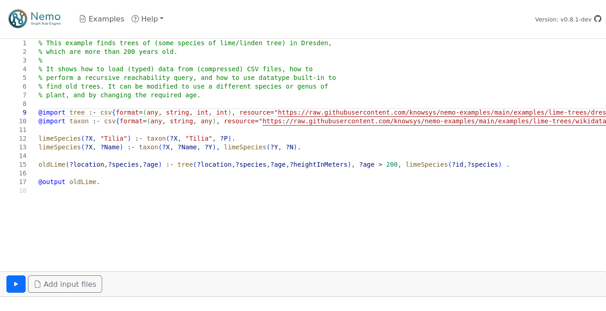

# nemo-web

Interactive Web-Frontend for the Nemo Rule Engine/Reasoner.

</img>

This project uses:

- Web assembly to execute the Nemo Rule Engine which is written in Rust
- Web workers to perform heavy computation in the background (Nemo reasoning, Monaco editor)
- File system API for downloading reasoning results

## Development

After building the [Nemo WASM library](https://github.com/knowsys/nemo/tree/main/nemo-wasm), start a development server:

```bash
# Copy nemo VSIX extension to the correct location
mkdir nemoVSIX
cp $PATH_TO_NEMO_VSIX/nemo-X.X.X.vsix nemoVSIX/nemo.vsix
# Copy nemo-wasm library to the correct location
cp -r $PATH_TO_NEMO_WASM/nemoWASMBundler ./nemoWASMBundler

npm install
npm run dev
```

Before committing changes:

```bash
npm run lint
```

### Technologies used in this project

- Programming language: TypeScript
- Single page application framework: Vite
- Rendering: React.js
- State management: React.js and Redux
- Code editor: Monaco Editor

### Getting started

Useful starting points for hacking on the code:

- Implementation of the program execution panel: [src/components/rightPanel/executionPanel/ExecutionPanel.tsx](src/components/rightPanel/executionPanel/ExecutionPanel.tsx)
- Interaction with the Nemo web assembly API: [src/nemoWorker/NemoRunner.ts](src/nemoWorker/NemoRunner.ts)
- Example Nemo programs: [src/components/examples/files/listOfExamples.ts](src/components/examples/files/listOfExamples.ts)
- Nemo Syntax highlighting and other language features: [src/components/leftPanel/editor/monacoLangaugeNemo.ts](src/components/leftPanel/editor/monacoLangaugeNemo.ts)

## Production build

After building the [Nemo WASM library](https://github.com/knowsys/nemo/tree/main/nemo-wasm), create a production build in the `dist` folder that can be served by a static web server:

```bash
# Copy nemo VSIX extension to the correct location
mkdir nemoVSIX
cp $PATH_TO_NEMO_VSIX/nemo-X.X.X.vsix nemoVSIX/nemo.vsix
# Copy nemo-wasm library to the correct location
cp -r $PATH_TO_NEMO_WASM/nemoWASMBundler ./nemoWASMBundler

npm install
NODE_OPTIONS=--max_old_space_size=4096 npm run build

# for local preview of the production build
npm preview
```
